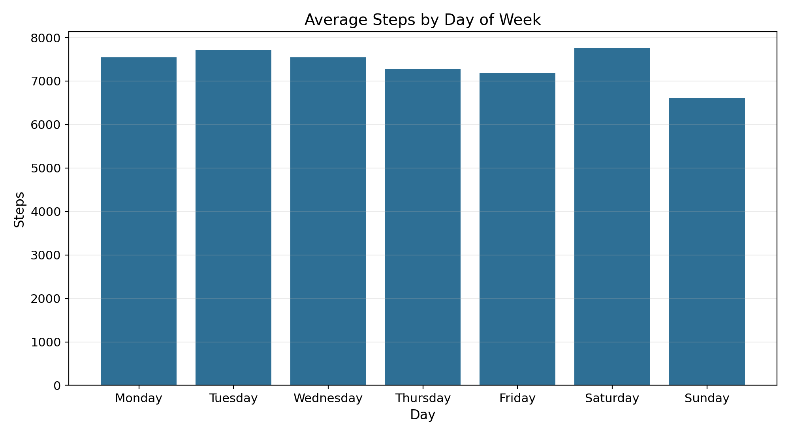

# Bellabeat Case Study: Smart Fitness Device Usage

## Overview
This project analyzes public Fitbit smart‑device data to identify usage trends and translate them into marketing insights for Bellabeat products.

## TL;DR
- Users average **7,377 steps/day**, and only **31.3%** of days hit 10k steps.
- Average sleep is **6.99 hours**; **44.2%** of nights are under 7 hours.
- Step activity peaks midday and early evening (top hours: **12pm, 6–7pm**).

## Business Task
Identify trends in smart device usage, apply them to Bellabeat customers, and propose high‑level marketing recommendations.

## Tools
- SQL (BigQuery‑style)
- Excel (pivot tables and charts)
- Python (reproducible summaries)
- R (analysis template)
- Tableau / Power BI (visualization concepts)

## Data Sources
- Fitbit Fitness Tracker Data (Kaggle, CC0, Mobius): https://www.kaggle.com/datasets/arashnic/fitbit
- Two date ranges: 3/12/2016–4/11/2016 and 4/12/2016–5/12/2016
- Raw CSVs are stored locally in `data/raw/` (not committed to GitHub)

## Key Findings (2016 sample)
- **Avg steps/day:** 7,377
- **Days ≥10k steps:** 31.3%
- **Avg sleep:** 6.99 hours; **44.2%** of nights <7 hours
- **Steps vs calories correlation:** 0.58 (moderate positive)
- **Peak activity hours:** 12pm, 6–7pm
- **Most active day:** Saturday; lowest steps on Sunday

## Recommendations (High‑Level)
1. **Midday + evening engagement:** Push reminders around 12pm and 6–7pm when activity peaks.
2. **Sleep improvement messaging:** Promote sleep‑focused content and Bellabeat membership guidance, targeting users with <7h sleep.
3. **Weekend activity campaigns:** Encourage weekend movement with challenges and short workouts when steps typically dip on Sunday.

## Repository Structure
- `data/processed/` — analysis outputs for Excel/Tableau/Power BI
- `scripts/` — Python analysis scripts
- `sql/` — SQL queries to reproduce metrics
- `r/` — R analysis template
- `figures/` — charts and Power BI exports

## Power BI Report
- Power BI Desktop file: `figures/Smart_fitness_device_PowerBI.pbix` (open with Power BI Desktop on Windows)
- Exported report PDF: `figures/Smart_fitness_device_figures.pdf`
- All visuals are built in Power BI from the processed tables.

## Results at a Glance


## How to Reproduce
1. Place the Kaggle Fitbit CSVs in `data/raw/` (see `process.md`).
2. Run:
   ```bash
   python3 scripts/analyze_bellabeat.py
   ```
3. Open `data/processed/` in Excel, Tableau, or Power BI.

## Notes / Limitations
- Sample size is small (35 users for activity, 24 for sleep).
- Data is from 2016 and may not represent today’s device usage.
- No demographic detail; usage patterns may not generalize.
